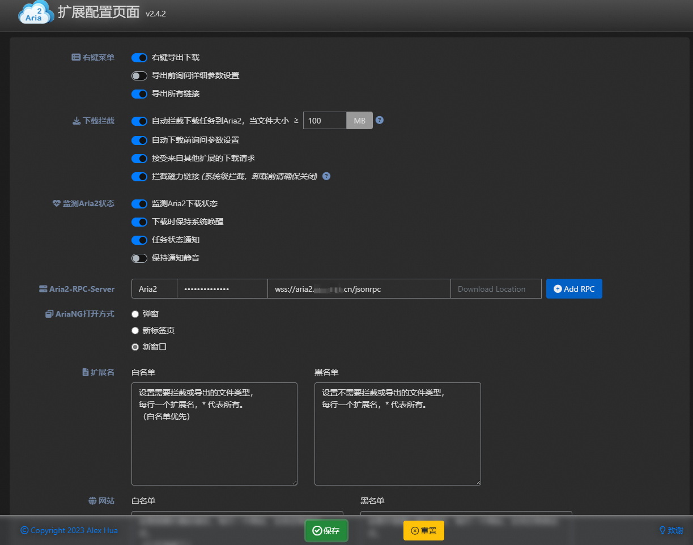

docker 部署 Aria2 下载器，并在浏览器端配置 Aria2 Explorer

<!-- more -->

# docker 部署 aria2

## 一小段废话

我家所在的小区运营商不提供公网ip，所以只好使用内网穿透的方式从公网访问家中服务。

某日想起来查看了一下 nps 服务端的设备监控，90% 的 CPU 使用率吓了我一跳。  经排查，原来是 nps 服务资源占用过高。


那么为什么一个小小的 nps 服务会有这么高的资源沿用呢？

原来是我使用了 [Aria2 Explorer](https://microsoftedge.microsoft.com/addons/detail/aria2-explorer/jjfgljkjddpcpfapejfkelkbjbehagbh?hl=zh-CN) 这个浏览器插件查看下载进度。但是配置时偷懒选择了 http 协议！


这样在使用 Aria2 Explorer 查看下载进度时，会无限轮询后端 Aria2 服务，导致 CPU 占用率飙升。

我赶紧修改了配置，改为 ws 协议，果然 CPU 使用率下降了。

考虑到会有人和我一样使用 Aria2 Explorer，所以写了这篇文章，希望能帮到大家。

## 部署 Aria2

### 安装 docker

在你的下载服务器上执行下方命令

```bash
sudo wget -qO- https://get.docker.com/ | bash
```

如果提示没有安装 wget 的话安装一下就成。

### 拉取镜像并运行

```bash

sudo docker run -d\
    --name aria2 \
    --restart unless-stopped \
    --log-opt max-size=1m \
    -e PUID=$UID \
    -e PGID=$GID \
    -e UMASK_SET=022 \
    -e RPC_SECRET=自己设置一个密码\
    -e RPC_PORT=6800 \
    -p 6800:6800 \
    -e LISTEN_PORT=6888 \
    -p 6888:6888 \
    -p 6888:6888/udp \
    -v /etc/aria2-config:/config \
    -v 下载存放的绝对路径:/downloads \
    p3terx/aria2-pro

```

将以上命令中中文的部分替换为你的实际情况。

例子：

```bash

sudo docker run -d\
    --name aria2 \
    --restart unless-stopped \
    --log-opt max-size=1m \
    -e PUID=$UID \
    -e PGID=$GID \
    -e UMASK_SET=022 \
    -e RPC_SECRET=passwd\
    -e RPC_PORT=6800 \
    -p 6800:6800 \
    -e LISTEN_PORT=6888 \
    -p 6888:6888 \
    -p 6888:6888/udp \
    -v /etc/aria2-config:/config \
    -v ~/downloads:/downloads \
    p3terx/aria2-pro

```

运行成功后 aria2 就装好了，配置文件不需要修改。

## 安装与配置 Aria2 Explorer

### 安装

这里以 Edge 为例

打开网址：[aria2-explorer](https://microsoftedge.microsoft.com/addons/detail/aria2-explorer/jjfgljkjddpcpfapejfkelkbjbehagbh?hl=zh-CN)

点击获取


点击添加扩展


### 配置



`Secret Key` 是你在 docker run 时设置的 `RPC_SECRET`

`RPC URL` 是你 aria2 服务器的公网 IP，端口是你在 docker run 时设置的 `RPC_PORT`，协议使用 `ws` 或 `wss` 结尾需要加上
`/jsonrpc`

`RPC URL` 例子：`ws://10.102.3.243:6800/jsonrpc`

配置完成后点击保存，如果是使用服务器公网ip的情况就已经 OK 了。

如果是使用内网穿透且使用 nginx 做了反向代理的话，通过域名是无法直接使用 ws 的。这种情况我们接着往下看。

## 使用内网穿透的情况

### 配置 nginx

在反向代理服务器（内网穿透中转服务器）配置 nginx

在`http`区块下加入如下配置，注意修改域名和端口，需要修改的地方加了备注：【按实际情况来写】

```nginx
# aria2
upstream aria2 {
    least_conn;
    server 127.0.0.1:26800 weight=10 max_fails=5 fail_timeout=5s;
    # 26800 是内网穿透对公网暴露的端口【按实际情况来写】
}
server {
    listen 80;
    listen 443 ssl http2;
    server_name aria2.example.com;
    # aria2.example.com 是给 aria2 配置的域名【按实际情况来写】
    if ($server_port !~ 443){
        rewrite ^(/.*)$ https://$host$1 permanent;
    }
    ssl_certificate  /etc/nginx/ssl/aria2.example.com.cer;
    ssl_certificate_key  /etc/nginx/ssl/aria2.example.com.key;
    # 上面两条是你域名的证书存放的绝对路径【按实际情况来写】
    ssl_protocols TLSv1.1 TLSv1.2 TLSv1.3;
    ssl_ciphers EECDH+CHACHA20:EECDH+CHACHA20-draft:EECDH+AES128:RSA+AES128:EECDH+AES256:RSA+AES256:EECDH+3DES:RSA+3DES:!MD5;
    ssl_prefer_server_ciphers on;
    ssl_session_cache shared:SSL:10m;
    ssl_session_timeout 10m;
    add_header Strict-Transport-Security "max-age=31536000";
    location / {
        proxy_pass http://aria2;
        proxy_http_version 1.1;
        proxy_redirect     off;
        proxy_set_header   Host             $host;
        proxy_set_header   X-Real-IP        $remote_addr;
        proxy_set_header   X-Forwarded-For  $proxy_add_x_forwarded_for;
        proxy_set_header   Upgrade          $http_upgrade;
        proxy_set_header   Connection       "Upgrade";
        proxy_next_upstream error timeout invalid_header http_500 http_502 http_503 http_504;
        proxy_max_temp_file_size   0;
        proxy_connect_timeout      1800;     #nginx与upstream server的连接超时时间(单位：s)
        proxy_send_timeout         1800;     #nginx发送数据至 upstream server超时, 默认60s, 如果连续的60s内没有发送1个字节, 连接关闭
        proxy_read_timeout         1800;    #nginx接收 upstream server数据超时, 默认60s, 如果连续的60s内没有收到1个 字节, 连接关闭
        proxy_buffer_size          4k;       #代理请求缓存区_这个缓存区间会保存用户的头信息以供Nginx进行规则处理_一 般只要能保存下头信息即可
        proxy_buffers              4 32k;    #同上 告诉Nginx保存单个用的几个Buffer最大用多大空间      
        proxy_busy_buffers_size    64k;      #如果系统很忙的时候可以申请更大的proxy_buffers 官方推荐*2            proxy_temp_file_write_size 64k;   #proxy缓存临时文件的大小
    }
}
```

配置成功后重载 nginx 就 OK 了