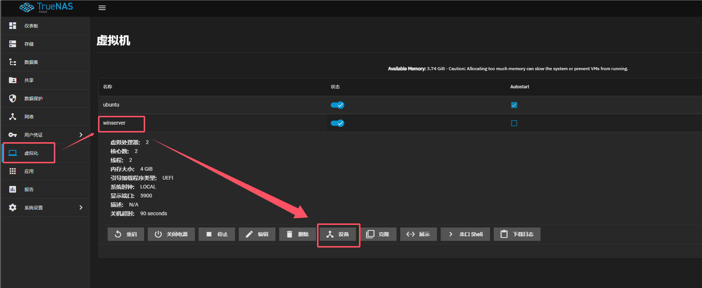

# TrueNAS虚拟机备份

## 虚拟机导出

TrueNAS Scale虚拟化使用ZVOL存储虚拟机，存储路径为：

```shell
/dev/zvol
```

依次点击 虚拟化 -> 设备 -> 磁盘 -> 编辑 就可以看到该虚拟机具体路径




使用dd命令可将虚拟机打包为raw格式的img文件：

```shell
dd if=/dev/zvol/main/winserver-93x9q3 of=/mnt/main/backup/winserver.img
```

其中if为源文件即为zvol文件，of为导出目的文件。

## 虚拟机导入

可以使用dd命令在新建zvol文件之后导入zvol文件:

```shell
dd if=/mnt/main/backup/winserver.img of=/dev/zvol/main/winserver-93x9q3
```