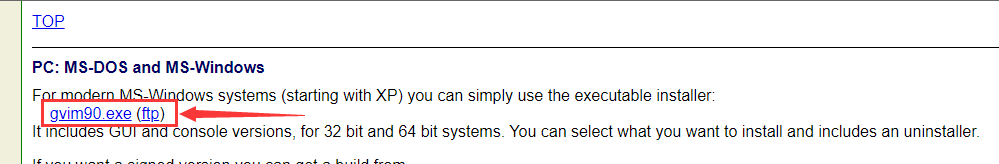
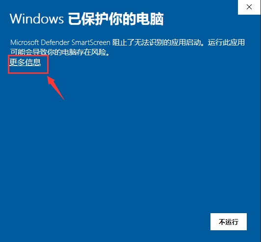

据媒体报导，2022届高校毕业生规模预计达1076万人，同比增加167万人，再创历史新高。

如此大规模的毕业生涌入人才市场，企业该如何消化呢？又有什么办法能够降低就业难度呢？

以我拙见，这并非老板需要考虑的问题，而是需要我们在职社畜来进行努力。努力的方向也很简单：停止内卷、投身摸鱼事业，降低单人工作量以增加就业岗位。

今天，就教大家一个摸鱼小技巧——使用Vim上班看小说。

<!-- more -->

## 一、声明

本教程仅适用于部分程序开发岗。

若是HR、医生、教师、设计师、警察、财务等工作中很少用到代码编辑器的岗位则不适用本教程。如果因为本教程而导致遭到领导训斥，本文作者不承担任何责任。

## 二、下载并安装 Vim（会装的同学请跳过这一步）

这里只提供windows的下载与安装方法。

官方下载地址：https://www.vim.org/download.php#pc



点这个gvimxx.exe进行下载

下载完成后直接打开，有的时候电脑比较敏感，会提示有风险。其实没啥风险。点击更多信息里面的仍要安装就可以了。




然后无脑下一步就可以了。

安装成功后设置环境变量

在桌面的快捷方式上右键，打开文件所在位置。


复制刚刚打开的目录路径


按 win 键，输入“环境变量”并点击“编辑系统环境变量”


依次进行：点击“环境变量” – 双击“Path” – 双击空白处 – 粘贴前面复制的 vim 目录路径 – 一路点击“确定”


按 win 键，输入“powershell” 并按回车进入 powershell。

在 powershell 中执行“vim –version”检查一下是否安装成功了吧！


## 三、配置 vim

在 powershell 中执行“vim ~/.vimrc”

按一下 “:” 键（英文 “:”），输入 “set paste”并按回车进入粘贴模式，此模式文本粘贴将会保留原有的文本格式，而不会自动格式化。

然后按 “i” 键，进入编辑模式。

把下面的内容复制进去。

``` bash
" 按一下空格往下翻两行
map <Space> 2j
" 老板键 按 F2 保存退出
map <F2> <Esc>ZZ
" 记忆上次编辑位置
autocmd BufReadPost *
\ if line("'\"")>0&&line("'\"")<=line("$") |
\ exe "normal g'\"" |
\ endif
" 设置文件编码格式
set encoding=utf-8
set fileencodings=utf-8,chinese,latin-1,gbk,gb18030,gk2312
if has("win32")
  set fileencoding=chinese
else
  set fileencoding=utf-8
endif
" 允许退格键删除和tab操作
set smartindent
set smarttab
set expandtab
set tabstop=4
set softtabstop=4
set shiftwidth=4
set backspace=2
set textwidth=79
set nu
" 高亮
syntax on
"colorscheme delek
"colorscheme elflord
"colorscheme murphy
colorscheme pablo
```

完事按 ”Esc“ 键，输入”:wp!“并按回车，保存退出。前面的冒号跟叹号都是英文符号！


这样 vim 的配置就大功告成了。

## 四、普通的看小说

随便打开一个编辑器或是IDE，只要是带命令窗口的就可以，比如 vscode、pycharm、eclipes，这里拿 vscode 做演示。

在命令窗口中执行 ”vim 小说的绝对路径“ 就可以打开小说了。


效果是这样


按空格可以往下翻两行，按 F2 可以保存并退出。再次打开时还可以继续上次看的位置继续看。

## 五、powershell 下更优雅地看小说

在powershell中执行命令`New-Item -Type file -Force $profile`创建profile


执行`vim $profile`打开profile，并切换倒粘贴编辑模式，上文中有写。

然后把以下内容粘贴进去，其中第三行是存放小说的绝对路径，根据实际情况修改，切记不要有中文。

``` powershell
function rn {
    param([string]$set)
    $novel_dir="C:\Users\Administrator\Documents\txt"
    if (-not (Test-Path $novel_dir\novel)){
        echo "" > $novel_dir\novel
    }
    $cur_txt_name=cat $novel_dir\novel
    if ($args[0] -like "-l"){
        $name_list = dir $novel_dir\*.txt
        if ($name_list.basename.count -eq 0){
            echo "There is no txt file in the $novel_dir"
            ii $novel_dir
        } elseif ($name_list.basename.count -eq 1){
            $name_list.basename
        } else {
            for ($i=0;$i -lt $name_list.basename.length;$i++){
                if ($name_list.basename[$i] -like $cur_txt_name){
                    "* " + $name_list.basename[$i]
                } else {
                    $name_list.basename[$i]
                }
            }
        }
        return
    }
    if ($args[0] -like "-o"){
        ii $novel_dir
        return
    }
    if ($set){
        $new_path = "$novel_dir\$set.txt"
        if (Test-Path $new_path){
            echo $set > $novel_dir\novel
            return
        } else {
            echo "The path does not exist. use 'rn -l'"
        }
    }
    $novel_path = "$novel_dir\$cur_txt_name.txt"
    if (-not (Test-Path $novel_path)){
        echo "The path $novel_path does not exist. use 'rn -l' and 'rn -set <text name>'"
        return
    }
    vim $novel_path
}
```

完成后保存退出，并重新打开powershell。

power中执行 `rn -o`可以打开小说存放目录。


`rn -l` 可以列出该目录中的所有小说，如果没有小说则会提示。


`rn -s 小说名`可以设置默认小说


然后再输入`rn`就可以直接看小说了！