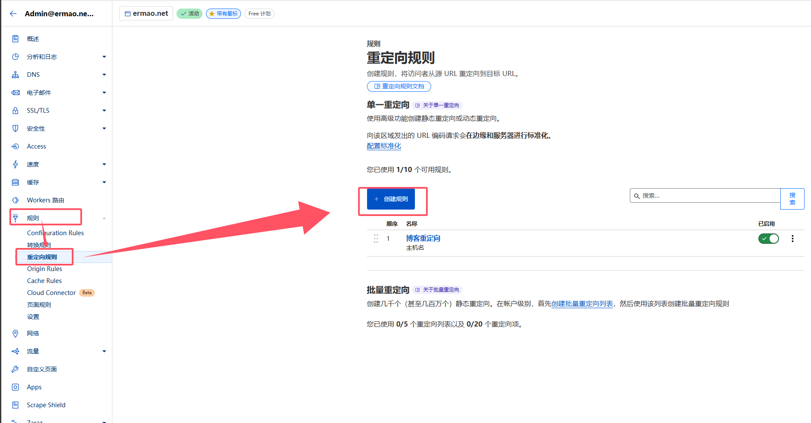

之前我的博客一直使用 wordpress，但是由于 wordpress 太过笨重、维护难度大、国内访问速度慢、还需要花钱租用后端服务器。所以我决定迁移到 github pages 重搞一个博客。

但是之前放在公网上的文章链接都是 wordpress 的，我又舍不得放弃这部分流量，所以用 cloudflare 进行URL重定向，原来的访问直接 301 跳转到了现在的地址。

需要迁移网站的同学不如试试这个方法，无痛迁移，还能保留原有的流量。

<!-- more -->

## 1. 在 cloudflare 解析你的域名


我要把 [blog.ermao.net](blog.ermao.net) 跟 [ermao.net](ermao.net) 的所有请求都重定向到 [www.ermao.net](www.ermao.net)。

所以要将 [blog.ermao.net](blog.ermao.net) 跟 [ermao.net](ermao.net) 都在cloudflare上解析。这个 ip 可以随便填，但是代理状态必须是已代理。

目标地址 [www.ermao.net](www.ermao.net) 则正常使用`CNAME`解析到 github pages 即可。

## 2. 在 cloudflare 进行URL重定向



依次点击`规则` -> `重定向规则` -> `创建规则`。


规则名字随便写，字段类型选`主机名`，字段值填你要重定向的域名。

URl 重定向类型选`动态`，表达式填写你的目标地址，例如：

```javascript
concat("https://www.ermao.net", http.request.uri.path)
```

完事点击`保存`

## 3. 等待生效

这玩意生效还得几分钟到几小时，试着访问一下原域名，如果带着路径跳转到目标地址就说明生效了。

例如访问 [https://blog.ermao.net/posts/vpn/](https://blog.ermao.net/posts/vpn/) 就直接跳转到 [https://www.ermao.net/posts/vpn/](https://www.ermao.net/posts/vpn/) 了。

## 4. 问题

有啥问题可以留言，我会尽量解答。