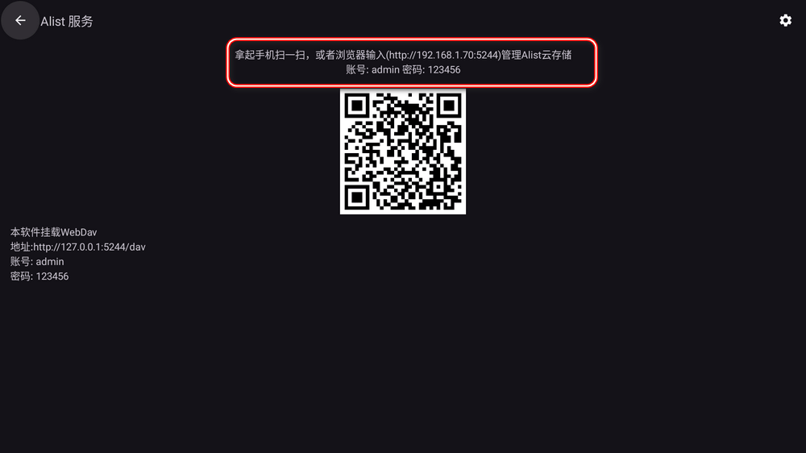
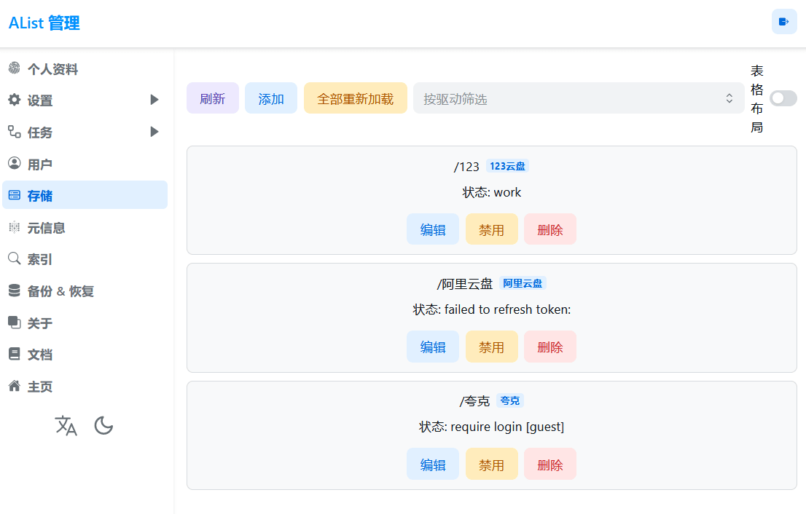

推荐一些安卓TV软件，以及下载地址。

<!-- more -->

## BLBL

一个第三方哔哩哔哩客户端，仅供学习与交流使用。该应用仅作为个人兴趣开发，应用没有任何破解行为，只是对于B站已有的API进行封装，所有数据来自于B站官方API，本人不对内容负责。应用通过firebase和appcenter收集的数据包括用户设备相关信息，以及崩溃日志，不会收集你的个人信息。

### 项目地址

[https://github.com/xiaye13579/BBLL](https://github.com/xiaye13579/BBLL)

### 下载地址

[BBLL1.5.1.apk](https://github.com/xiaye13579/BBLL/releases/download/v1.5.1/BBLL1.5.1.apk)

## 想唱K歌

免费的K歌软件，可以链接蓝牙麦克风在家K歌。

### 下载地址

[想唱K歌.apk](https://github.com/ermaozi/ermao.net/releases/download/latest/KTV.apk)

## AList TV 网盘播放器

AList TV版，让你通过电视直接查看或者播放你所有网盘中的视频。据说这个TV版在官方已经下架，堪称绝版了——AList TV

### 下载地址

[AList TV.apk](https://github.com/ermaozi/ermao.net/releases/download/AlistTV/Alist.TV.apk)