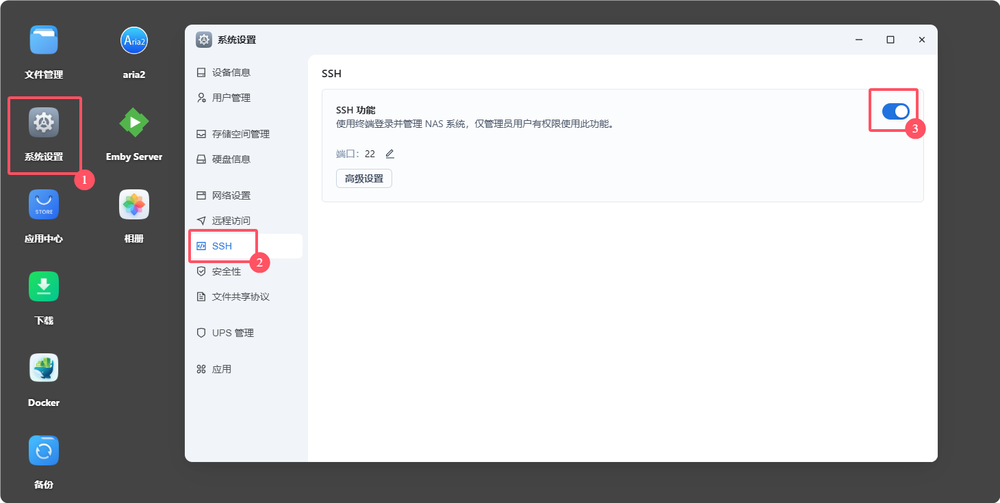
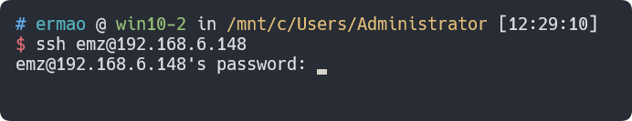
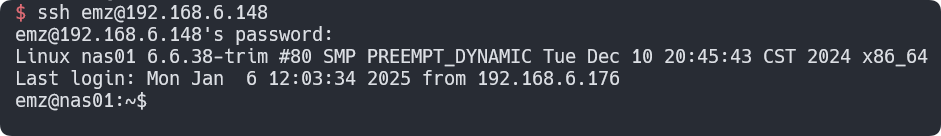
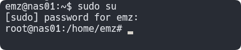
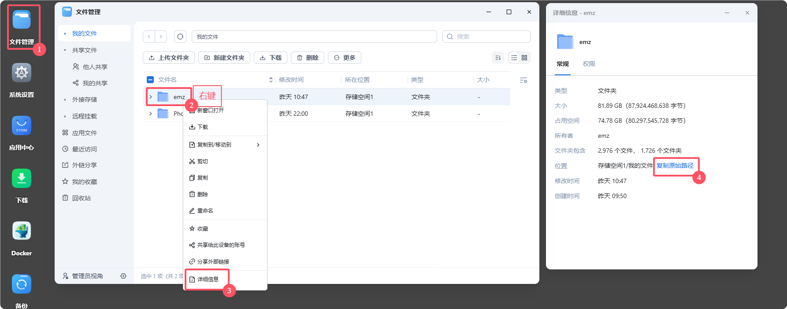
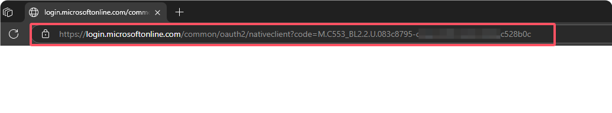
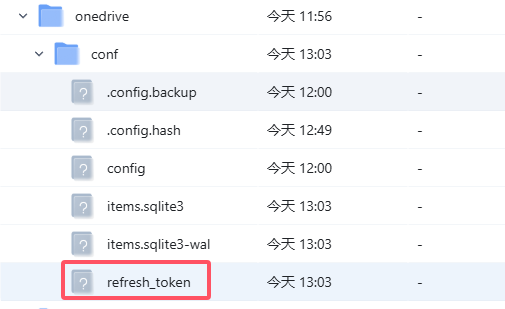
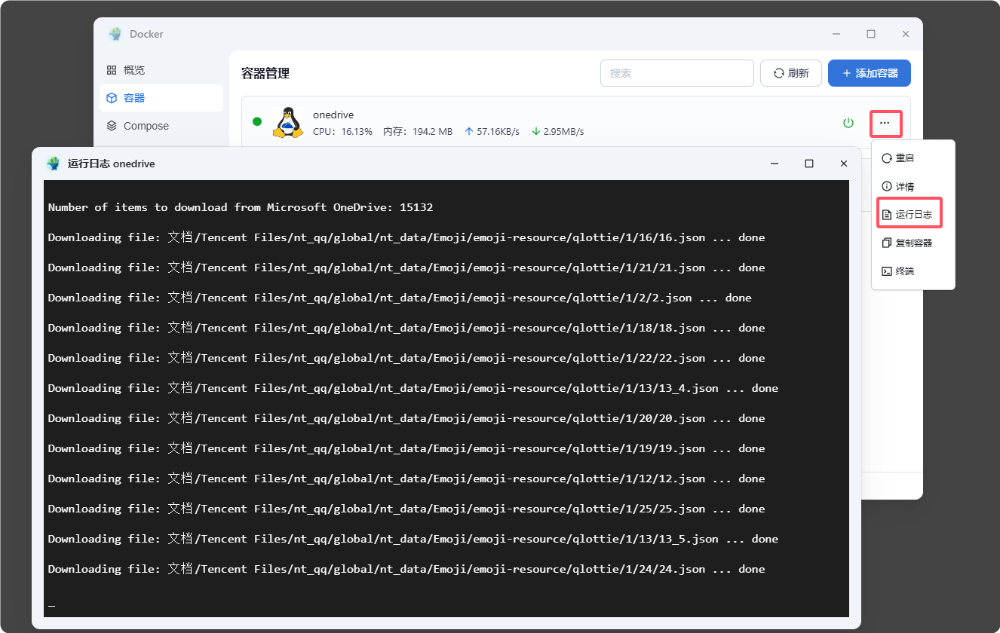

手把手教学飞牛OS如何通过docker安装OneDrive备份文件

<!-- more -->

## 前言

飞牛OS本身可以很方便的通过百度网盘跟阿里云盘做备份。

但是众所周知，你们的部分资源是不能存储在国内的网盘中（密码箱也不行）


所以不得不将她们备份到国外混乱不堪的环境中。

今天就来手把手教你如何通过 OneDrive 备份文件。

## 注册 OneDrive

你必须得有个微软账号，如果没有的话，你可以去注册一个。

[注册地址](https://signup.live.com/)

同时推荐在淘宝找人拼车买个 Microsoft 365，这会使你的 OneDrive 空间变成 1T。

## 登入飞牛OS后台命令行

因为登陆时需要`交互式操作`，所以我们需要登陆后台命令行。

首先我们开启飞牛OS的 SSH 功能。



然后在你本地终端登陆你的飞牛OS后台。

``` bash
ssh 飞牛用户名@飞牛地址
```

如下图



密码就是你的飞牛OS后台密码。注意，输入密码时是不会显示的，直接往上敲就可以了。

如果用户名、IP、密码都正确的话，你就可以登陆成功了。



## 切换为 root 用户

``` bash
sudo su
```

这里需要再输入一次密码，直接输入就好了。



你的用户名后面的`$`变成了`#`，这就表示你已经切换为 root 用户了。

## 准备好配置文件的目录

在飞牛OS后台，通常文件会在`/vol1/1000/你的用户名/`目录下。

其中`vol1`是存储池的编号，`1000`是你的用户编号。

你也可以依次点击 `文件管理` -> `我的文件` -> `右键目录` -> `详细信息` -> `复制原始路径` 来获取你的目录的路径。



获取到了目录之后，我们给这个目录创建一个文件夹，用来持久化存储容器的配置文件。

``` bash
mkdir -p /vol1/1000/你的用户名/docker/onedrive/conf/
```

这个路径按你自己实际情况来就可以。

## 拉取镜像、创建容器

``` bash
docker run -it --name onedrive \
    -v /vol1/1000/你的用户名/docker/onedrive/conf/:/onedrive/conf \
    -v 需要被同步的路径:/onedrive/data \
    -e "ONEDRIVE_UID=1000" \
    -e "ONEDRIVE_GID=1000" \
    driveone/onedrive:latest
```

记得把上面的两处汉字`你的用户名`跟`需要被同步的路径`替换实际的值。

例如这个例子：

``` bash
docker run -it --name onedrive \
    -v /vol1/1000/emz/docker/onedrive/conf:/onedrive/conf \
    -v /vol1/1000/emz/同步/onedrive:/onedrive/data \
    -e "ONEDRIVE_UID=1000" \
    -e "ONEDRIVE_GID=1000" \
    driveone/onedrive:latest
```

容器启动后，会提示你登陆 OneDrive。点击其中的链接，然后登陆你的 OneDrive 账号。这时候会跳转到一个页面，需要复制这个页面的地址，然后回到终端，粘贴到终端中，回车。




成功登陆后，容器会自动开始同步你的文件。


同时你的配置文件中也会多出来一个名叫`refresh_token`的文件，这个文件是用来保存你的登陆信息的。如果以后修改了微软密码，需要将这个文件删除，然后重复上面的步骤。

如果以后想迁移到其他地方，可以直接把整个`conf`文件夹拷贝过去。



## 后台持久运行

上面的步骤是首次登陆时需要交互式操作，但是 `ctrl + c` 退出后，容器就会停止。

我们需要重新启动容器，并且让容器在后台持久运行。

首先删除之前的容器

``` bash
docker rm -f onedrive
```

然后重新启动容器，跟首次部署不同的是，其中`-it`改为`-d`，同时添加`--restart always`。

``` bash
docker run -d --name onedrive \
    --restart always \
    -v /vol1/1000/你的用户名/docker/onedrive/conf/:/onedrive/conf \
    -v 需要被同步的路径:/onedrive/data \
    -e "ONEDRIVE_UID=1000" \
    -e "ONEDRIVE_GID=1000" \
    driveone/onedrive:latest
```

启动成功后，容器会在后台持久运行。并且飞牛OS的容器管理中也可以看到该容器了。


在运行日志中还可以看到容器的运行情况。



## 配置文件

`/vol1/1000/你的用户名/docker/onedrive/conf/`目录下有一个名字叫`config`的文件，这个文件是容器的配置文件。

你可以通过修改它来优化同步效果。

例如这是我的配置文件：

``` bash
# 容器中的需要被同步的目录
sync_dir = "/onedrive/data"
# 自定义哪些文件夹不被同步，这里是双向的，本地和云端都生效（本地的不会上传，云端的不会下载）
skip_dir = "~*|.~*|*.tmp"
# 忽略所有隐藏文件和文件夹
skip_dotfiles = "true"
```

关于配置文件的详细说明可以参考官方文档

[https://github.com/abraunegg/onedrive/blob/master/docs/usage.md](https://github.com/abraunegg/onedrive/blob/master/docs/usage.md)

## docker 命令简单介绍

`-it`：表示交互式操作，其中`i`是交互式操作，`t`是创建一个终端。

`-d`：表示后台运行。

`--name`：容器的名字，可以自定义。

`-v`：挂载目录，左边是宿主机目录，右边是容器目录。

`-e`：环境变量，用于传递参数。

`--restart always`：表示容器退出后自动重启。